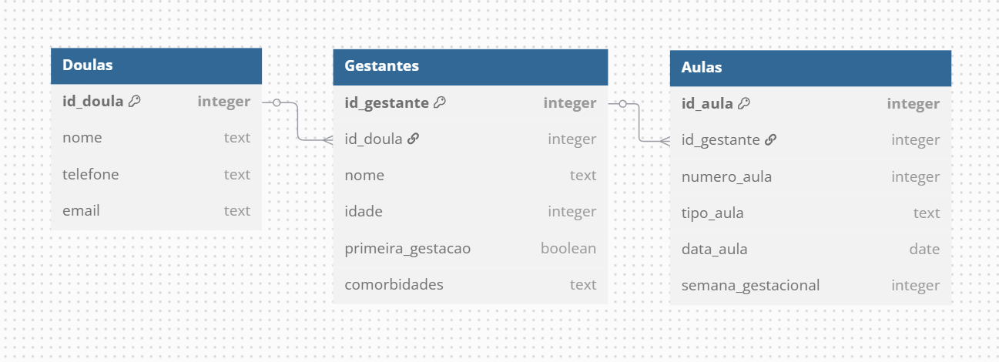

# Gerenciador de Doulas
Sistema de controle e acompanhamento de doulandas.


# Estrutura do Banco de Dados - Sistema de Cadastro de Doulas e Gestantes V1



Estrutura inicial do banco de dados para o sistema de cadastro de **Doulas**, **Gestantes** e **Aulas**. Componentes centrais:
- A descrição de cada tabela;
- Os campos e os tipos de dados utilizados;
- Os relacionamentos entre as tabelas;
- As queries SQL para criação das tabelas no **PostgreSQL**, **SQLserver** (bancos relacionais de forma geral).

## Estrutura das Tabelas

### 1️.Tabela `Doulas`

A tabela `Doulas` armazena informações sobre as profissionais cadastradas no sistema.
#### **Campos e Tipos de Dados:**
- **`id_doula` (SERIAL):** Identificador único da doula. É a chave primária da tabela.
- **`nome` (TEXT):** Nome completo da doula.
- **`telefone` (TEXT):** Número de telefone da doula.
- **`email` (TEXT UNIQUE):** Endereço de e-mail único da doula, que não pode se repetir.

#### **Query de Criação:**
```sql
CREATE TABLE Doulas (
    id_doula SERIAL PRIMARY KEY,
    nome TEXT NOT NULL,
    telefone TEXT NOT NULL,
    email TEXT UNIQUE NOT NULL
);
```

### 2.Tabela `Gestantes`

A tabela `Gestantes` armazena os dados das gestantes acompanhadas pelas doulas.
#### **Campos e Tipos de Dados:**
- **`id_gestante` (SERIAL):** Identificador único da gestante. É a chave primária da tabela.
- **`id_doula` (INTEGER):** Identificador da doula responsável. É uma chave estrangeira que referencia o campo `id_doula` da tabela `Doulas`.
- **`nome` (TEXT):** Nome completo da gestante.
- **`idade` (INTEGER):** Idade da gestante.
- **`primeira_gestacao` (BOOLEAN):** Indica se a gestante está em sua primeira gestação (valor verdadeiro ou falso).
- **`comorbidades` (TEXT):** Descrição de possíveis comorbidades da gestante.

#### **Query de Criação:**
```sql
CREATE TABLE Gestantes (
    id_gestante SERIAL PRIMARY KEY,
    id_doula INTEGER NOT NULL,
    nome TEXT NOT NULL,
    idade INTEGER NOT NULL,
    primeira_gestacao BOOLEAN NOT NULL,
    comorbidades TEXT,
    FOREIGN KEY (id_doula) REFERENCES Doulas(id_doula) ON DELETE CASCADE
);
```

### 3️.Tabela `Aulas`

A tabela `Aulas` registra as aulas ministradas para cada gestante.
#### **Campos e Tipos de Dados:**
- **`id_aula` (SERIAL):** Identificador único da aula. É a chave primária da tabela.
- **`id_gestante` (INTEGER):** Identificador da gestante que participou da aula. É uma chave estrangeira que referencia o campo `id_gestante` da tabela `Gestantes`.
- **`numero_aula` (INTEGER):** Número sequencial da aula.
- **`tipo_aula` (TEXT):** Tipo de aula ministrada (por exemplo, parto, amamentação, cuidados com o bebê).
- **`data_aula` (DATE):** Data em que a aula foi realizada.
- **`semana_gestacional` (INTEGER):** Semana gestacional da gestante no momento da aula.

#### **Query de Criação:**
```sql
CREATE TABLE Aulas (
    id_aula SERIAL PRIMARY KEY,
    id_gestante INTEGER NOT NULL,
    numero_aula INTEGER NOT NULL,
    tipo_aula TEXT NOT NULL,
    data_aula DATE NOT NULL,
    semana_gestacional INTEGER NOT NULL,
    FOREIGN KEY (id_gestante) REFERENCES Gestantes(id_gestante) ON DELETE CASCADE
);
```

## Relacionamentos e Regras de Integridade
- **Relacionamento entre Doulas e Gestantes:**  
    Cada **doula** pode cadastrar **várias gestantes**. Por isso, o campo `id_doula` na tabela `Gestantes` é uma chave estrangeira que referencia a tabela `Doulas`.
    - **Regra:** Se uma doula for removida, todas as gestantes associadas serão automaticamente excluídas (ON DELETE CASCADE).
- **Relacionamento entre Gestantes e Aulas:**  
    Cada **gestante** pode ter **múltiplas aulas** registradas. Assim, o campo `id_gestante` na tabela `Aulas` é uma chave estrangeira que referencia a tabela `Gestantes`.
    - **Regra:** Se uma gestante for removida, todas as aulas associadas também serão apagadas (ON DELETE CASCADE).


# API e Backend
# Front